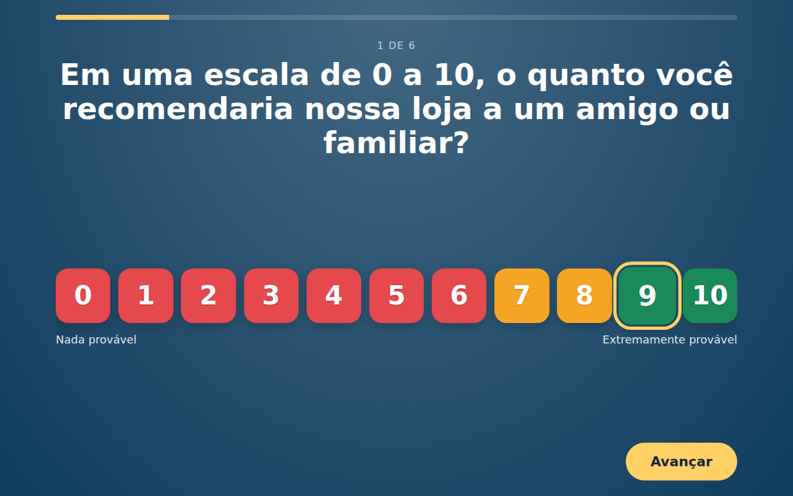
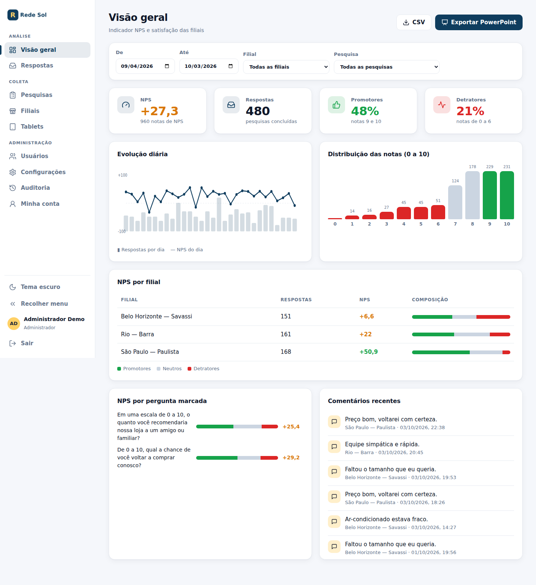
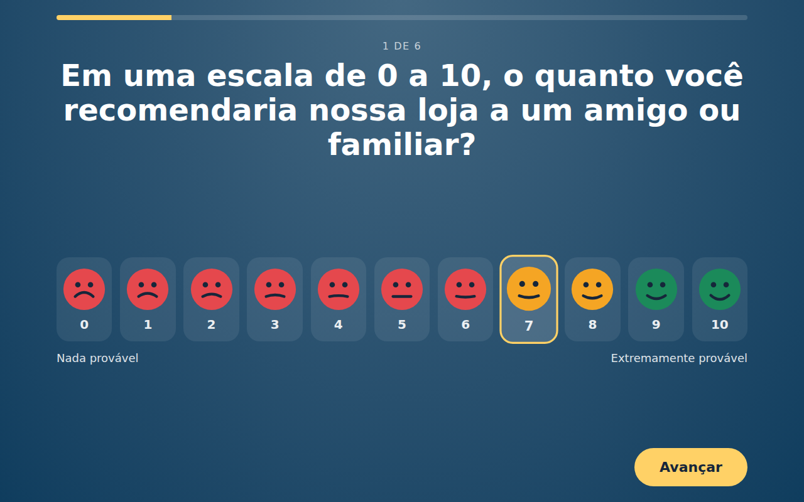
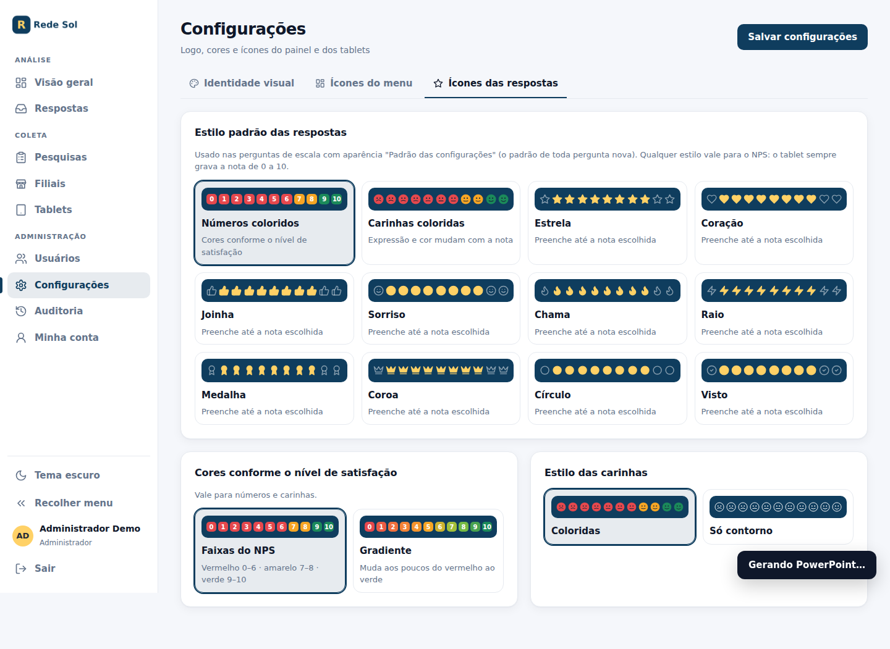

# Pesquisa de Satisfação (NPS) — multi-filial

Sistema de coleta de pesquisa de satisfação para **tablets em modo quiosque**, com **painel administrativo** e análise de **NPS**.

- **Painel:** `/admin` — NPS geral/por filial/por pergunta, respostas, exportação CSV, pesquisas, filiais, tablets, usuários, auditoria.
- **Configurações:** logo, favicon, ícone do app, cores, ícones do menu e estilo das respostas (números coloridos, carinhas coloridas, estrelas, corações…).
- **PowerPoint:** relatório com gráficos nativos, logo e cores da empresa.
- **Casos:** cada nota de 0 a 6 vira um caso para tratar; alerta por e-mail, webhook ou WhatsApp.
- **Segurança:** 2FA, recuperação de senha, LGPD (consentimento, criptografia, retenção, pedidos do titular).
- **Coleta:** tablet em modo quiosque e QR Code por filial, perguntas condicionais, campanhas agendadas, PT/EN/ES.
- **Fuso horário por filial:** o horário de funcionamento vale no fuso do tablet (modo automático) ou num fuso fixo escolhido na filial; a empresa é a reserva. Vale também para campanhas, alerta de tablet sem sinal e e-mails.
- **E-mail e WhatsApp pelo painel:** Configurações → E-mail e WhatsApp (SMTP com provedores prontos, API oficial da Meta, teste de conexão e fila de envios). Senhas e tokens ficam criptografados e nunca voltam à tela; o servidor SMTP precisa ser público (bloqueia rede interna). Cada pessoa pode cadastrar o próprio WhatsApp em Minha conta.
- **Auditoria em português:** cada ação vira uma frase (quem, o quê, onde), com filtros por tipo, busca e destaque do que merece atenção.
- **Localização das respostas (QR Code):** o cliente pode autorizar a localização; o sistema grava cidade (município do IBGE mais próximo), UF e região, com o ponto arredondado a ~1 km. Tudo offline, sem serviços externos; o ponto é apagado pela política de retenção e a cidade/UF ficam só como estatística. Aparece em Respostas, no filtro por estado, no quadro "Origem das respostas" e no CSV. Nos tablets o local é a cidade da filial.
- **Tablet:** `/kiosk` — sem login; ativado uma vez com código gerado no painel; respostas sempre gravadas na filial do tablet.

```bash
npm install
npm run create-admin -- voce@empresa.com "Seu Nome"
npm start          # http://127.0.0.1:3000/admin
npm test           # 75 testes de segurança
```

Requer Node.js 22.13+.

| Documento | Para quê |
|---|---|
| [docs/DEPLOY.md](docs/DEPLOY.md) | Colocar no ar na VPS (Docker, HTTPS, backup) |
| [docs/INSTALACAO-TABLET.md](docs/INSTALACAO-TABLET.md) | Instalar e travar os tablets nas filiais |
| [docs/PLANEJAMENTO.md](docs/PLANEJAMENTO.md) | Arquitetura, segurança e testes |

## Telas

| Tablet | Painel |
|---|---|
|  |  |
|  |  |
